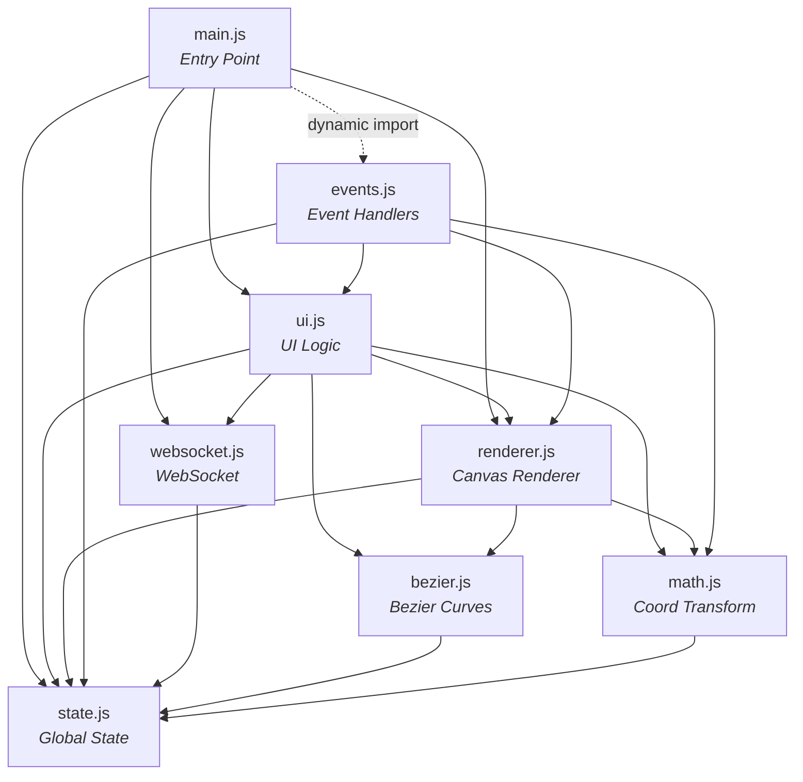

# Polebot AGV — Path Editor (Bezier)

> Web-based path planning GUI for AMR (Autonomous Mobile Robots) using Bezier curves, with real-time ROS connectivity via WebSocket.


---

## Table of Contents

- [Overview](#-overview)
- [Key Features](#-key-features)
- [System Architecture](#-system-architecture)
- [Project Structure](#-project-structure)
- [JavaScript Modules](#-javascript-modules)
- [Getting Started](#-getting-started)
- [Usage Guide](#-usage-guide)
- [WebSocket Protocol](#-websocket-protocol)
- [Keyboard Shortcuts](#-keyboard-shortcuts)
- [Robot Configuration](#-robot-configuration)
- [Coordinate System](#-coordinate-system)
- [Troubleshooting](#-troubleshooting)

---

## Overview

**Polebot AGV Path Editor** is a web-based interface for visually planning and controlling AGV/AMR robot paths. Operators can draw paths using a **Pen Tool** powered by cubic Bezier curves, monitor the robot's position in real-time (Digital Twin), and send control commands through a WebSocket connection to ROS (Robot Operating System).

### Typical Workflow

```
┌──────────────┐     WebSocket      ┌──────────────┐      ROS       ┌───────────┐
│   Web GUI    │ ◄═══════════════► │  ROS Bridge  │ ◄════════════► │   Robot   │
│  (Browser)   │   JSON messages    │  (rosbridge) │   ROS Topics   │  (Jetson) │
└──────────────┘                    └──────────────┘                └───────────┘
```

1. **Load Map** — Drag & drop a map file (`.png`/`.pgm`) + metadata (`.yaml`) onto the canvas
2. **Draw Path** — Click for corner points, click-drag for smooth Bezier curves
3. **Send to Robot** — The path is sampled into dense waypoints and sent via WebSocket
4. **Monitor** — Watch the robot's position, heading, and Lidar scan in real-time

---

## Key Features

### Pen Tool (Bezier Path Drawing)
| Action | Result |
|--------|--------|
| **Click** | Creates a corner point (sharp pivot) |
| **Click + Drag** | Creates a smooth curve point with Bezier handles |
| **Drag handle** | Adjusts the curve curvature |
| **Alt + Drag handle** | Breaks handle symmetry (independent control) |
| **Right-click** | Deletes the last anchor or the one clicked |

### Corner Rounding (Fillet)
- Automatically converts sharp corners into tangent arcs with a fixed radius
- Adjustable radius (0.20 m – 1.00 m)
- Toggle per-corner or all at once

### Map & Navigation
- Drag & drop `.png`/`.pgm` map files + `.yaml` metadata (ROS map_server format)
- Smooth animated zoom (scroll wheel)
- Pan (drag to move the map)
- Map rotation (0° – 359°) with ±90° buttons and slider
- Auto-scaling grid & rulers

### Digital Twin
- Displays the robot's real-time position and heading overlaid on the map
- Robot visualized as a box with a heading arrow
- Field of view indicator

### Lidar Scan Visualization
- Displays real-time Lidar scan points from the robot
- Color-coded by distance (red < 1m, orange < 2.5m, yellow > 2.5m)
- Auto-expires after 2 seconds without updates

### 2D Pose Estimate
- Manually set the robot's position and orientation on the map
- Click-drag to define position (click) and heading direction (drag)
- Computes the transformation offset between odometry and map position

### Measurement Tool
- Measure distances between points on the map
- Multi-segment measurement support
- Shows distance (meters) and angle per segment

### Loop Path & Continuous Patrol
- Close any path into a loop with a single click
- **Continuous Mode**: robot patrols indefinitely
- **Single Loop Mode**: robot stops after one loop

### Status & Control
- WebSocket connection status indicator (connected/disconnected)
- Robot position: X, Y, Heading
- Current waypoint progress
- State machine status: `IDLE`, `RUNNING`, `PAUSED`, `STOPPED`, `DONE`
- Phase indicator: `PIVOT` (turning) or `FORWARD` (moving)
- Obstacle warning

---

## System Architecture

```
┌─────────────────────────────────────────────────────────────┐
│                        Web Browser                          │
│                                                             │
│  ┌─────────┐  ┌──────────┐  ┌──────────┐  ┌─────────────┐ │
│  │ index   │  │  CSS     │  │  JS      │  │   Canvas    │ │
│  │ .html   │──│ style.css│──│ Modules  │──│  Renderer   │ │
│  └─────────┘  └──────────┘  └──────────┘  └─────────────┘ │
│                                  │                          │
│                          ┌───────┴───────┐                  │
│                          │  WebSocket    │                  │
│                          │  Connection   │                  │
│                          └───────┬───────┘                  │
└──────────────────────────────────┼──────────────────────────┘
                                   │ ws://jetson-ip:9090
                          ┌────────┴────────┐
                          │   ROS Bridge    │
                          │  (rosbridge_    │
                          │   websocket)    │
                          └────────┬────────┘
                                   │
                    ┌──────────────┼──────────────┐
                    │              │              │
              ┌─────┴─────┐ ┌─────┴─────┐ ┌─────┴─────┐
              │   Path    │ │  Odometry │ │   Lidar   │
              │  Follower │ │   Node    │ │   Node    │
              └───────────┘ └───────────┘ └───────────┘
```

---

## Project Structure

```
AGV AMR/
├── index.html          # Entry point (modular version)
├── web_gui.html        # Standalone version (everything in 1 file)
├── css/
│   └── style.css       # Complete stylesheet (742 lines)
├── js/
│   ├── main.js         # Entry point module — initialization & global exposure
│   ├── state.js        # State management — all global variables
│   ├── math.js         # Coordinate transforms & math utilities
│   ├── bezier.js       # Bezier curve algorithms & fillet computation
│   ├── renderer.js     # Canvas rendering engine
│   ├── ui.js           # UI logic, controls, and status callbacks
│   ├── events.js       # Event listeners (mouse, keyboard, drag-drop)
│   └── websocket.js    # WebSocket connection & message handling
└── README.md           # This documentation
```

### Two File Versions

| File | Description |
|------|-------------|
| `web_gui.html` | **Standalone** — all HTML, CSS, and JS in a single file (~1700 lines). Easy to distribute. |
| `index.html` + `js/` + `css/` | **Modular** — code split into ES6 modules. Easier to maintain and extend. |

Both versions provide **identical functionality**.

---

## JavaScript Modules

### Dependency Graph



### Module Details

#### `state.js` — State Management
Stores **all global application variables** in a single `state` object:

| Property | Type | Description |
|----------|------|-------------|
| `ws` | WebSocket\|null | Active WebSocket connection |
| `tool` | string | Active tool: `'pen'`, `'pose'`, `'measure'`, `'pan'` |
| `anchors` | Array | List of Bezier anchor points |
| `robot` | Object\|null | Robot position `{x, y, yaw_deg}` |
| `scan` | Array | Lidar scan points |
| `mapImg` | Image\|null | Loaded map image object |
| `meta` | Object\|null | Map metadata `{resolution, ox, oy}` |
| `vx, vy` | number | Viewport offset (pan position) |
| `vs, ts` | number | Current / target zoom level |
| `mapRot` | number | Map rotation in degrees |
| `sampleStepM` | number | Path sampling distance (default 0.05 m) |
| `cornerRadiusM` | number | Corner fillet radius (default 0.50 m) |
| `poseOffset` | Object\|null | Transform offset `{dyawDeg, dx, dy}` |

Robot constants:
- `ROBOT_LEN_M = 0.25` m (robot length)
- `ROBOT_WIDTH_M = 0.24` m (robot width)

---

#### `math.js` — Coordinate Transforms

Handles conversion between 4 coordinate systems:

```
  Map (meters)          Image (pixels)        Rotated Image        Canvas (screen px)
  ┌───────────┐         ┌───────────┐         ┌───────────┐        ┌───────────┐
  │ x,y (m)   │ ──────► │ px,py     │ ──────► │ px,py     │ ─────► │ px,py     │
  │ real-world│mapToImgPx│ raw image│rotateImgPx│ rotated  │ *vs+v  │ screen    │
  └───────────┘         └───────────┘         └───────────┘        └───────────┘
```

| Function | From → To | Description |
|----------|-----------|-------------|
| `mapToImgPx(mx, my)` | Map → Image | Converts meter coordinates to image pixels |
| `imgPxToMap(px, py)` | Image → Map | Converts image pixels to meters |
| `rotateImgPx(px, py, deg)` | Image → Rotated | Rotates image pixels around center |
| `mapToCanvas(mx, my)` | Map → Canvas | Converts meters to screen pixels |
| `canvasToMap(cx, cy)` | Canvas → Map | Converts screen pixels to meters |
| `pxPerMetre()` | — | Returns current pixels per meter |

**Pose Offset Functions:**

| Function | Description |
|----------|-------------|
| `applyOffset(rawX, rawY, rawYawDeg)` | Applies offset to raw odometry position |
| `recomputeOffset(corrX, corrY, corrYawDeg)` | Recalculates offset from corrected position |
| `inverseApplyOffset(mapX, mapY)` | Converts map position back to raw odometry |

---

#### `bezier.js` — Bezier Curves & Fillet

| Function | Description |
|----------|-------------|
| `segCtrl(a, b)` | Generates 4 cubic Bezier control points from 2 anchors |
| `isCornerA(a)` | Checks if an anchor is a corner (no handles) |
| `computeFillet(i)` | Computes the fillet arc for corner at index i |
| `buildDense()` | Builds a dense polyline from all Bezier segments + fillets |
| `densePath()` | Alias for `buildDense()` |
| `resample(poly, stepM)` | Re-samples a polyline with fixed inter-point distance |
| `sampleCurve(stepM)` | Builds dense + resamples in one call |
| `pathLengthM()` | Calculates total path length in meters |

**Corner Fillet Algorithm:**
1. For each corner anchor marked `round = true`
2. Compute the bisector between the two meeting segments
3. Determine tangent points on both segments
4. Generate a circular arc between the two tangent points
5. Radius is clamped to not exceed 49% of the shortest segment length

---

#### `renderer.js` — Canvas Rendering

The `draw()` function renders the entire canvas in this layer order:

```
Layer 1: Grid (scale lines)
Layer 2: Map image (.png/.pgm)
Layer 3: Lidar scan (colored dots)
Layer 4: Bezier path (line + direction arrows)
Layer 5: Bezier handles (lines + blue circles)
Layer 6: Anchor dots (colored squares/circles + numbers)
Layer 7: Digital Twin robot (box + heading arrow)
Layer 8: Pose arrow / Measurement overlay
Layer 9: Edge rulers (horizontal & vertical scale)
```

Other key functions:

| Function | Description |
|----------|-------------|
| `resizeCv()` | Resizes canvas to match container |
| `rrPath(x,y,w,h,r)` | Draws a rounded rectangle path |
| `drawRulers(W,H,rh)` | Draws scale rulers along canvas edges |
| `drawMeasurement()` | Draws the measurement distance overlay |
| `clearMeasure()` | Clears all measurement points |
| `animZ()` | Smooth zoom animation (ease-out) |
| `showFrd(text)` / `hideFrd()` | Shows/hides the info bar at the top |

---

#### `ui.js` — UI Logic & Controls

**Robot Controls:**

| Function | Description |
|----------|-------------|
| `sendPath()` | Samples the Bezier path → sends to ROS as waypoint array |
| `cmd(c)` | Sends a command: `'pause'`, `'resume'`, `'stop'`, `'rerun'` |
| `onSpd(v)` | Sets robot speed (0.1 – 0.8 m/s) |
| `closeLoop()` | Closes the path into a loop + continuous patrol option |
| `sendPose(x, y, yaw)` | Sends pose estimate + updates the offset transform |

**Status Callbacks (from WebSocket):**

| Function | Trigger | Description |
|----------|---------|-------------|
| `updStatus(s)` | `{state, x, y, yaw_deg, ...}` | Updates sidebar status + robot position |
| `updPose(d)` | `{type:'robot_pose', ...}` | Updates position from AMCL/odometry |
| `updScan(p)` | `{type:'scan', points:[...]}` | Updates Lidar scan points |

**Pen Tool Functions:**

| Function | Description |
|----------|-------------|
| `penDown(e)` | Handles mousedown: hit-test anchor/handle or create new |
| `penMove(e)` | Handles mousemove: drag anchor, handle, or preview |
| `penUp()` | Handles mouseup: release drag |
| `penDelete(e)` | Handles right-click: delete anchor |
| `hitAnchor(sx, sy)` | Hit-tests anchors within 11px radius |
| `hitHandle(sx, sy)` | Hit-tests handles within 9px radius |

---

#### `websocket.js` — WebSocket Connection

| Function | Description |
|----------|-------------|
| `toggleConn()` | Opens/closes the WebSocket connection |
| `sw(obj)` | Sends a JSON message to the server |
| `setWsCallbacks({...})` | Registers callback functions (avoids circular dependencies) |

---

#### `events.js` — Event Listeners

Registers all event listeners on the canvas and document:

| Event | Target | Action |
|-------|--------|--------|
| `click` | Canvas | Adds a measurement point (measure tool) |
| `contextmenu` | Canvas | Deletes an anchor or measurement point |
| `mousedown` | Canvas | Starts pan/pose/pen action |
| `mousemove` | Canvas | Updates coordinates, dragging, preview |
| `mouseup` | Canvas | Finishes pan/pose/pen action |
| `wheel` | Canvas | Zoom in/out with smooth animation |
| `dragover` | Document | Prevents default (enables drop) |
| `drop` | Document | Loads map/yaml files |
| `keydown` | Document | Keyboard shortcuts |

---

## Getting Started

### Prerequisites
- A modern browser (Chrome, Firefox, Edge) with ES6 Module support
- ROS map files (optional): `.png`/`.pgm` + `.yaml`
- ROS Bridge WebSocket server (for robot connectivity)

### Option 1: Open Directly (Standalone)
```bash
# Open the standalone file directly in your browser
# (no server needed for the standalone version)
open web_gui.html
```

### Option 2: With HTTP Server (Modular — Recommended)
```bash
# Using Python
cd "AGV AMR"
python -m http.server 8080

# Then open in your browser:
# http://localhost:8080/index.html
```

> ⚠️ **Important:** The modular version (`index.html`) requires an HTTP server because browsers block ES6 `import` statements from the `file://` protocol.

### Option 3: With a ROS Robot
```bash
# On the robot side (Jetson/PC running ROS):
roslaunch rosbridge_server rosbridge_websocket.launch

# In the browser, connect to:
ws://<jetson-ip>:9090
```

---

## Usage Guide

### 1. Loading a Map

**Drag & Drop:**
- Drag a `.png`/`.pgm` file (map image) onto the canvas area
- Drag a `.yaml` file (map metadata) onto the canvas area

**File Picker:**
- Press `Ctrl+O` to open the file picker
- Select map and yaml files

**Supported YAML format:**
```yaml
image: map.pgm
resolution: 0.050000
origin: [-10.000000, -10.000000, 0.000000]
negate: 0
occupied_thresh: 0.65
free_thresh: 0.196
```

Only `resolution` and `origin` are used by the GUI.

### 2. Drawing a Path

1. Make sure the **Pen Tool** is active (first button in toolbar, or press `D`)
2. **Corner point**: Single click on the canvas
3. **Curve point**: Click and hold + drag to create Bezier handles
4. **Edit**: Drag an anchor to reposition it, drag a handle to adjust curvature
5. **Delete**: Right-click on an anchor to remove it

### 3. Corner Rounding

1. Check **"Bulatkan sudut"** (Round corners) in the Control sidebar
2. Adjust the **Radius** slider (0.20 – 1.00 m)
3. Corners automatically become smooth arcs
4. Click the "corner"/"rounded" label in the Anchor list to toggle individual points

### 4. Sending a Path to the Robot

1. Ensure WebSocket is connected (green indicator in the header)
2. Set **Speed** with the slider (0.1 – 0.8 m/s)
3. Set **Sampling** distance (gap between waypoints: 2 – 20 cm)
4. Click **"▶ Jalankan Jalur"** (Run Path)

### 5. Loop & Continuous Patrol

1. Draw a path with at least 3 points
2. Click **" Tutup Jalur (Loop)"** (Close Path Loop)
3. Choose a mode:
   - **Continuous**: Robot loops indefinitely
   - **Single**: Robot stops after one complete loop

### 6. 2D Pose Estimate

1. Click the **Pose** tool in the toolbar (or press `P`)
2. Click and hold at the robot's position on the map
3. Drag in the direction the robot is facing
4. Release — position and offset are sent to ROS

---

## WebSocket Protocol

### Messages Sent (GUI → Robot)

#### Set Path
```json
{
  "type": "set_path",
  "points": [
    {"x": 1.2345, "y": -0.6789},
    {"x": 1.3000, "y": -0.7200}
  ]
}
```

#### Rerun Last Path
```json
{
  "type": "rerun"
}
```

#### Pose Estimate
```json
{
  "type": "pose_estimate",
  "x": 1.5,
  "y": -2.3,
  "yaw": 1.5708
}
```
> `yaw` is in radians.

#### Commands
```json
{"cmd": "pause"}
{"cmd": "resume"}
{"cmd": "stop"}
{"cmd": "set_speed", "value": 0.40}
{"cmd": "enable_loop"}
{"cmd": "disable_loop"}
```

### Messages Received (Robot → GUI)

#### Robot Status
```json
{
  "state": "RUNNING",
  "x": 1.234,
  "y": -0.567,
  "yaw_deg": 45.0,
  "waypoint": 5,
  "total_wp": 20,
  "phase": "FORWARD",
  "obstacle": false
}
```

| Field | Type | Description |
|-------|------|-------------|
| `state` | string | `IDLE`, `RUNNING`, `PAUSED`, `STOPPED`, `DONE` |
| `x`, `y` | number | Robot position (meters, odometry frame) |
| `yaw_deg` | number | Robot heading (degrees) |
| `waypoint` | number | Current waypoint index |
| `total_wp` | number | Total waypoints |
| `phase` | string | `PIVOT` (turning in place) or `FORWARD` (driving) |
| `obstacle` | boolean | Obstacle detected |

#### Robot Pose (from AMCL)
```json
{
  "type": "robot_pose",
  "source": "amcl",
  "x": 1.234,
  "y": -0.567,
  "yaw_deg": 45.0
}
```

#### Path Acknowledgement
```json
{
  "type": "path_ack",
  "data": {
    "status": "ok",
    "message": "Path received: 150 waypoints"
  }
}
```

#### Lidar Scan
```json
{
  "type": "scan",
  "points": [
    {"x": 0.5, "y": 0.1},
    {"x": 1.2, "y": -0.3}
  ]
}
```
> Coordinates are relative to the robot (local frame).

---

## Keyboard Shortcuts

| Key | Action |
|-----|--------|
| `D` | Activate Pen Tool |
| `P` | Activate Pose Tool |
| `M` | Activate Measurement Tool |
| `Space` | Toggle Pan / Pen Tool |
| `Ctrl+O` | Open file picker (map + yaml) |
| `Ctrl+Z` | Undo (remove last anchor) |
| `Escape` | Clear all anchors / clear measurement |
| `[` | Rotate map -5° |
| `]` | Rotate map +5° |
| `Scroll` | Zoom in/out |

---

## Robot Configuration

Robot physical constants are defined in `js/state.js`:

```javascript
ROBOT_LEN_M  = 0.25   // Robot length (meters)
ROBOT_WIDTH_M = 0.24   // Robot width (meters)
```

Default parameters:

| Parameter | Default | Range | Description |
|-----------|---------|-------|-------------|
| Speed | 0.40 m/s | 0.1 – 0.8 | Robot linear velocity |
| Sampling | 5 cm | 2 – 20 cm | Gap between path waypoints sent to ROS |
| Corner Radius | 0.50 m | 0.2 – 1.0 m | Fillet radius for rounded corners |
| Map Rotation | 0° | 0 – 359° | Visual map rotation |

---

## Coordinate System

### Map Coordinate Frame
- **X positive** = right
- **Y positive** = up
- **Yaw positive** = counter-clockwise
- Units: **meters** and **radians** (degrees for display)

### Offset Transform (Pose Correction)

The GUI supports a transformation between the **odometry frame** and the **map frame**:

```
Map position = Rotation(offset_yaw) × Odometry_position + Translation_offset
```

The offset is recalculated when:
1. The user performs a **2D Pose Estimate** manually
2. A pose update is received from **AMCL** (Adaptive Monte Carlo Localization)

Paths sent to the robot are always in the **odometry frame** (the inverse transform is applied automatically).

---

## Troubleshooting

### Blank page / errors when opening `index.html`
**Cause:** Browser blocks ES6 module imports from `file://` protocol.  
**Fix:** Use an HTTP server:
```bash
python -m http.server 8080
```

### Canvas does not respond to clicks
**Cause:** The active tool is not the Pen Tool.  
**Fix:** Press `D` or click the Pen icon in the toolbar.

### Map does not appear after drag & drop
**Cause:** The `.yaml` file is missing, or files were loaded in the wrong order.  
**Fix:** Make sure both files (`.png` + `.yaml`) are dropped. They can be dropped together or separately.

### Robot is not visible on the map
**Cause:** No position data received from WebSocket, or no map loaded.  
**Fix:** 
1. Ensure the WebSocket connection is active (green indicator)
2. Ensure the map + yaml are loaded
3. Use **2D Pose Estimate** to set the position manually

### Path won't send
**Cause:** At least 2 anchor points are required.  
**Fix:** Place at least 2 points on the canvas before clicking "Jalankan Jalur" (Run Path).

### WebSocket connection fails
**Cause:** ROS bridge is not running or the IP/port is wrong.  
**Fix:**
```bash
# On the robot side, make sure rosbridge is running:
roslaunch rosbridge_server rosbridge_websocket.launch
# Verify the IP and port are correct (default: ws://192.168.137.40:9090)
```

---

## License

MIT License

---

<p align="center">
  <b>Polebot AGV Path Editor</b> — Built for precise and intuitive autonomous robot control.
</p>
