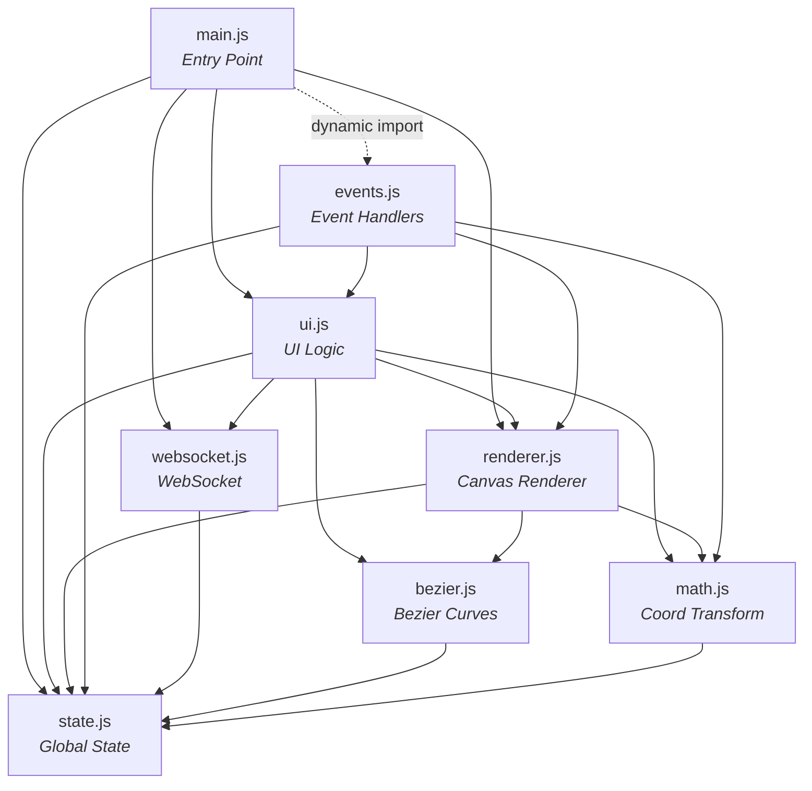

# 🤖 Polebot AGV — Path Editor (Bezier)

> Web-based path planning GUI untuk AMR (Autonomous Mobile Robot) menggunakan kurva Bezier, dengan koneksi real-time ke ROS via WebSocket.


---

## 📑 Daftar Isi

- [Gambaran Umum](#-gambaran-umum)
- [Fitur Utama](#-fitur-utama)
- [Arsitektur Sistem](#-arsitektur-sistem)
- [Struktur Proyek](#-struktur-proyek)
- [Modul JavaScript](#-modul-javascript)
- [Cara Menjalankan](#-cara-menjalankan)
- [Panduan Penggunaan](#-panduan-penggunaan)
- [Protokol WebSocket](#-protokol-websocket)
- [Keyboard Shortcuts](#-keyboard-shortcuts)
- [Konfigurasi Robot](#-konfigurasi-robot)
- [Coordinate System](#-coordinate-system)
- [Troubleshooting](#-troubleshooting)

---

## 🔍 Gambaran Umum

**Polebot AGV Path Editor** adalah antarmuka web untuk merencanakan dan mengontrol jalur robot AGV/AMR secara visual. Operator dapat menggambar jalur menggunakan **Pen Tool** berbasis kurva Bezier, memonitor posisi robot secara real-time (Digital Twin), dan mengirim perintah kontrol melalui koneksi WebSocket ke ROS (Robot Operating System).

### Alur Kerja Tipikal

```
┌──────────────┐     WebSocket      ┌──────────────┐      ROS       ┌───────────┐
│   Web GUI    │ ◄═══════════════► │  ROS Bridge  │ ◄════════════► │   Robot   │
│  (Browser)   │   JSON messages    │  (rosbridge) │   ROS Topics   │  (Jetson) │
└──────────────┘                    └──────────────┘                └───────────┘
```

1. **Muat Peta** — Drag & drop file peta (`.png`/`.pgm`) + metadata (`.yaml`) ke canvas
2. **Gambar Jalur** — Klik untuk corner point, klik-drag untuk kurva Bezier
3. **Kirim ke Robot** — Jalur di-sample menjadi titik-titik padat dan dikirim via WebSocket
4. **Monitor** — Pantau posisi robot, heading, dan scan Lidar secara real-time

---

## ✨ Fitur Utama

### 🖊️ Pen Tool (Bezier Path Drawing)
| Aksi | Hasil |
|------|-------|
| **Klik** | Membuat titik corner (sudut patah/pivot) |
| **Klik + Drag** | Membuat titik kurva mulus dengan handle Bezier |
| **Drag handle** | Mengatur kelengkungan kurva |
| **Alt + Drag handle** | Mematahkan simetri handle (independent control) |
| **Klik kanan** | Menghapus anchor terakhir atau yang diklik |

### 🔄 Corner Rounding (Fillet)
- Otomatis mengubah sudut patah menjadi busur tangen berradius tetap
- Radius dapat diatur (0.20 m – 1.00 m)
- Toggle per-corner atau semua sekaligus

### 🗺️ Peta & Navigasi
- Drag & drop file peta `.png`/`.pgm` + `.yaml` (format ROS map_server)
- Zoom (scroll wheel) dengan animasi halus
- Pan (geser peta)
- Rotasi peta (0° – 359°) dengan tombol ±90° dan slider
- Grid & ruler otomatis menyesuaikan skala

### 🤖 Digital Twin
- Menampilkan posisi dan heading robot secara real-time di atas peta
- Visualisasi robot sebagai kotak dengan panah arah
- Indikator field of view

### 📡 Scan Lidar
- Menampilkan titik-titik scan Lidar real-time dari robot
- Warna berubah berdasarkan jarak (merah < 1m, oranye < 2.5m, kuning > 2.5m)
- Auto-expire setelah 2 detik tanpa update

### 🎯 2D Pose Estimate
- Set posisi dan orientasi robot secara manual di peta
- Klik-drag untuk menentukan posisi (klik) dan arah (drag)
- Menghitung offset transformasi antara odometry dan posisi di peta

### 📏 Measurement Tool
- Ukur jarak antar titik di peta
- Multi-segment measurement
- Menampilkan jarak (meter) dan sudut per segmen

### 🔗 Loop Path & Continuous Patrol
- Tutup jalur menjadi loop dengan satu klik
- Opsi **Continuous Mode**: robot berpatroli tanpa henti
- Opsi **Single Loop**: robot berhenti setelah 1 putaran

### 📊 Status & Kontrol
- Status koneksi WebSocket (terhubung/terputus)
- Posisi robot: X, Y, Heading
- Progress waypoint saat ini
- Status state machine: `IDLE`, `RUNNING`, `PAUSED`, `STOPPED`, `DONE`
- Indikator fase: `PIVOT` (memutar) atau `FORWARD` (maju)
- Warning obstacle

---

## 🏗️ Arsitektur Sistem

```
┌─────────────────────────────────────────────────────────────┐
│                        Web Browser                          │
│                                                             │
│  ┌─────────┐  ┌──────────┐  ┌──────────┐  ┌─────────────┐ │
│  │ index   │  │  CSS     │  │  JS      │  │   Canvas    │ │
│  │ .html   │──│ style.css│──│ Modules  │──│  Renderer   │ │
│  └─────────┘  └──────────┘  └──────────┘  └─────────────┘ │
│                                  │                          │
│                          ┌───────┴───────┐                  │
│                          │  WebSocket    │                  │
│                          │  Connection   │                  │
│                          └───────┬───────┘                  │
└──────────────────────────────────┼──────────────────────────┘
                                   │ ws://jetson-ip:9090
                          ┌────────┴────────┐
                          │   ROS Bridge    │
                          │  (rosbridge_    │
                          │   websocket)    │
                          └────────┬────────┘
                                   │
                    ┌──────────────┼──────────────┐
                    │              │              │
              ┌─────┴─────┐ ┌─────┴─────┐ ┌─────┴─────┐
              │   Path    │ │  Odometry │ │   Lidar   │
              │  Follower │ │   Node    │ │   Node    │
              └───────────┘ └───────────┘ └───────────┘
```

---

## 📂 Struktur Proyek

```
AGV AMR/
├── index.html          # Entry point (modular version)
├── web_gui.html        # Versi standalone (semua dalam 1 file)
├── css/
│   └── style.css       # Stylesheet lengkap (742 baris)
├── js/
│   ├── main.js         # Entry point module — inisialisasi & expose globals
│   ├── state.js        # State management — semua variabel global
│   ├── math.js         # Transformasi koordinat & utilitas matematika
│   ├── bezier.js       # Algoritma kurva Bezier & fillet
│   ├── renderer.js     # Canvas rendering engine
│   ├── ui.js           # UI logic, kontrol, dan status callbacks
│   ├── events.js       # Event listeners (mouse, keyboard, drag-drop)
│   └── websocket.js    # Koneksi WebSocket & pengiriman pesan
└── README.md           # Dokumentasi ini
```

### Dua Versi File

| File | Keterangan |
|------|-----------|
| `web_gui.html` | **Standalone** — semua HTML, CSS, dan JS dalam satu file (~1700 baris). Mudah didistribusikan. |
| `index.html` + `js/` + `css/` | **Modular** — kode dipisah per modul ES6. Mudah di-maintain dan dikembangkan. |

Kedua versi memiliki **fungsionalitas identik**.

---

## 📦 Modul JavaScript

### Dependency Graph



### Detail Per Modul

#### `state.js` — State Management
Menyimpan **semua variabel global** aplikasi dalam satu objek `state`:

| Property | Tipe | Deskripsi |
|----------|------|-----------|
| `ws` | WebSocket\|null | Koneksi WebSocket aktif |
| `tool` | string | Tool aktif: `'pen'`, `'pose'`, `'measure'`, `'pan'` |
| `anchors` | Array | Daftar anchor point Bezier |
| `robot` | Object\|null | Posisi robot `{x, y, yaw_deg}` |
| `scan` | Array | Titik-titik scan Lidar |
| `mapImg` | Image\|null | Objek gambar peta yang dimuat |
| `meta` | Object\|null | Metadata peta `{resolution, ox, oy}` |
| `vx, vy` | number | Offset viewport (pan) |
| `vs, ts` | number | Zoom level saat ini / target |
| `mapRot` | number | Rotasi peta dalam derajat |
| `sampleStepM` | number | Jarak sampling jalur (default 0.05 m) |
| `cornerRadiusM` | number | Radius fillet corner (default 0.50 m) |
| `poseOffset` | Object\|null | Transformasi offset `{dyawDeg, dx, dy}` |

Konstanta robot:
- `ROBOT_LEN_M = 0.25` m (panjang robot)
- `ROBOT_WIDTH_M = 0.24` m (lebar robot)

---

#### `math.js` — Transformasi Koordinat

Menangani konversi antara 4 sistem koordinat:

```
  Map (meter)           Image (pixel)         Rotated Image        Canvas (screen px)
  ┌───────────┐         ┌───────────┐         ┌───────────┐        ┌───────────┐
  │ x,y (m)   │ ──────► │ px,py     │ ──────► │ px,py     │ ─────► │ px,py     │
  │ real-world│mapToImgPx│ raw image│rotateImgPx│ rotated  │ *vs+v  │ screen    │
  └───────────┘         └───────────┘         └───────────┘        └───────────┘
```

| Fungsi | Dari → Ke | Deskripsi |
|--------|-----------|-----------|
| `mapToImgPx(mx, my)` | Map → Image | Konversi koordinat meter ke pixel gambar |
| `imgPxToMap(px, py)` | Image → Map | Konversi pixel gambar ke meter |
| `rotateImgPx(px, py, deg)` | Image → Rotated | Rotasi pixel gambar |
| `mapToCanvas(mx, my)` | Map → Canvas | Konversi meter ke pixel layar |
| `canvasToMap(cx, cy)` | Canvas → Map | Konversi pixel layar ke meter |
| `pxPerMetre()` | — | Mengembalikan pixel per meter saat ini |

**Fungsi Offset Pose:**

| Fungsi | Deskripsi |
|--------|-----------|
| `applyOffset(rawX, rawY, rawYawDeg)` | Terapkan offset ke posisi odometry mentah |
| `recomputeOffset(corrX, corrY, corrYawDeg)` | Hitung ulang offset dari posisi terkoreksi |
| `inverseApplyOffset(mapX, mapY)` | Konversi balik posisi peta ke odometry mentah |

---

#### `bezier.js` — Kurva Bezier & Fillet

| Fungsi | Deskripsi |
|--------|-----------|
| `segCtrl(a, b)` | Menghasilkan 4 control point cubic Bezier dari 2 anchor |
| `isCornerA(a)` | Cek apakah anchor adalah corner (tanpa handle) |
| `computeFillet(i)` | Hitung busur fillet untuk corner ke-i |
| `buildDense()` | Bangun polyline padat dari semua segmen Bezier + fillet |
| `densePath()` | Alias untuk `buildDense()` |
| `resample(poly, stepM)` | Re-sample polyline dengan jarak tetap antar titik |
| `sampleCurve(stepM)` | Build dense + resample dalam satu panggilan |
| `pathLengthM()` | Hitung panjang total jalur dalam meter |

**Algoritma Fillet Corner:**
1. Untuk setiap corner anchor yang ditandai `round = true`
2. Hitung bisector antara 2 segmen yang bertemu
3. Tentukan tangent point pada kedua segmen
4. Generate busur lingkaran antara kedua tangent point
5. Radius dibatasi agar tidak melebihi 49% panjang segmen terpendek

---

#### `renderer.js` — Canvas Rendering

Fungsi `draw()` menggambar seluruh canvas dalam urutan layer:

```
Layer 1: Grid (garis-garis skala)
Layer 2: Peta (gambar .png/.pgm)
Layer 3: Scan Lidar (titik-titik berwarna)
Layer 4: Jalur Bezier (garis + panah arah)
Layer 5: Handle Bezier (garis + lingkaran biru)
Layer 6: Anchor dots (kotak/lingkaran berwarna + nomor)
Layer 7: Digital Twin robot (kotak + panah heading)
Layer 8: Pose arrow / Measurement overlay
Layer 9: Ruler tepi (skala horizontal & vertikal)
```

Fungsi penting lainnya:

| Fungsi | Deskripsi |
|--------|-----------|
| `resizeCv()` | Resize canvas sesuai container |
| `rrPath(x,y,w,h,r)` | Gambar rounded rectangle path |
| `drawRulers(W,H,rh)` | Gambar ruler skala di tepi canvas |
| `drawMeasurement()` | Gambar overlay pengukuran jarak |
| `clearMeasure()` | Hapus semua titik pengukuran |
| `animZ()` | Animasi smooth zoom |
| `showFrd(text)` / `hideFrd()` | Tampilkan/sembunyikan info bar atas |

---

#### `ui.js` — UI Logic & Kontrol

**Kontrol Robot:**

| Fungsi | Deskripsi |
|--------|-----------|
| `sendPath()` | Sample jalur Bezier → kirim ke ROS sebagai array titik |
| `cmd(c)` | Kirim perintah: `'pause'`, `'resume'`, `'stop'`, `'rerun'` |
| `onSpd(v)` | Set kecepatan robot (0.1 – 0.8 m/s) |
| `closeLoop()` | Tutup jalur menjadi loop + opsi continuous patrol |
| `sendPose(x, y, yaw)` | Kirim pose estimate + update offset |

**Status Callbacks (dari WebSocket):**

| Fungsi | Trigger | Deskripsi |
|--------|---------|-----------|
| `updStatus(s)` | `{state, x, y, yaw_deg, ...}` | Update sidebar status + posisi robot |
| `updPose(d)` | `{type:'robot_pose', ...}` | Update posisi dari AMCL/odometry |
| `updScan(p)` | `{type:'scan', points:[...]}` | Update titik-titik Lidar |

**Pen Tool Functions:**

| Fungsi | Deskripsi |
|--------|-----------|
| `penDown(e)` | Handle mousedown: hit-test anchor/handle atau buat baru |
| `penMove(e)` | Handle mousemove: drag anchor, handle, atau preview |
| `penUp()` | Handle mouseup: lepaskan drag |
| `penDelete(e)` | Handle klik kanan: hapus anchor |
| `hitAnchor(sx, sy)` | Hit-test anchor dalam radius 11px |
| `hitHandle(sx, sy)` | Hit-test handle dalam radius 9px |

---

#### `websocket.js` — Koneksi WebSocket

| Fungsi | Deskripsi |
|--------|-----------|
| `toggleConn()` | Buka/tutup koneksi WebSocket |
| `sw(obj)` | Kirim pesan JSON ke server |
| `setWsCallbacks({...})` | Register callback functions (menghindari circular dependency) |

---

#### `events.js` — Event Listeners

Mendaftarkan semua event listener pada canvas dan document:

| Event | Target | Aksi |
|-------|--------|------|
| `click` | Canvas | Tambah titik ukur (measure tool) |
| `contextmenu` | Canvas | Hapus anchor/titik ukur |
| `mousedown` | Canvas | Mulai pan/pose/pen action |
| `mousemove` | Canvas | Update koordinat, drag, preview |
| `mouseup` | Canvas | Selesai pan/pose/pen |
| `wheel` | Canvas | Zoom in/out dengan animasi |
| `dragover` | Document | Prevent default (enable drop) |
| `drop` | Document | Load file peta/yaml |
| `keydown` | Document | Keyboard shortcuts |

---

## 🚀 Cara Menjalankan

### Prasyarat
- Browser modern (Chrome, Firefox, Edge) dengan dukungan ES6 Modules
- File peta ROS (opsional): `.png`/`.pgm` + `.yaml`
- ROS Bridge WebSocket server (untuk koneksi ke robot)

### Opsi 1: Buka Langsung (Standalone)
```
# Buka file standalone langsung di browser
# (tidak perlu server untuk versi standalone)
open web_gui.html
```

### Opsi 2: Dengan HTTP Server (Modular — Direkomendasikan)
```bash
# Menggunakan Python
cd "AGV AMR"
python -m http.server 8080

# Buka di browser
# http://localhost:8080/index.html
```

> ⚠️ **Penting:** Versi modular (`index.html`) memerlukan HTTP server karena browser memblokir `import` dari `file://` protocol.

### Opsi 3: Dengan ROS Robot
```bash
# Di sisi robot (Jetson/PC dengan ROS):
roslaunch rosbridge_server rosbridge_websocket.launch

# Di browser, hubungkan ke:
ws://<jetson-ip>:9090
```

---

## 📖 Panduan Penggunaan

### 1. Memuat Peta

**Drag & Drop:**
- Drag file `.png`/`.pgm` (gambar peta) ke area canvas
- Drag file `.yaml` (metadata peta) ke area canvas

**File Picker:**
- Tekan `Ctrl+O` untuk membuka file picker
- Pilih file peta dan yaml

**Format YAML yang didukung:**
```yaml
image: map.pgm
resolution: 0.050000
origin: [-10.000000, -10.000000, 0.000000]
negate: 0
occupied_thresh: 0.65
free_thresh: 0.196
```

Hanya `resolution` dan `origin` yang digunakan oleh GUI.

### 2. Menggambar Jalur

1. Pastikan **Pen Tool** aktif (tombol pertama di toolbar, atau tekan `D`)
2. **Corner point**: Klik sekali di canvas
3. **Curve point**: Klik tahan + drag untuk membuat handle Bezier
4. **Edit**: Drag anchor point untuk memindahkan, drag handle untuk mengatur lengkung
5. **Hapus**: Klik kanan pada anchor untuk menghapus

### 3. Corner Rounding

1. Centang **"Bulatkan sudut"** di sidebar Kontrol
2. Atur **Radius** dengan slider (0.20 – 1.00 m)
3. Corner otomatis berubah menjadi busur mulus
4. Klik label "corner"/"rounded" di daftar Anchor untuk toggle per-titik

### 4. Mengirim Jalur ke Robot

1. Pastikan WebSocket terhubung (indikator hijau di header)
2. Atur **Kecepatan** dengan slider (0.1 – 0.8 m/s)
3. Atur **Sampling** (jarak antar titik: 2 – 20 cm)
4. Klik **"▶ Jalankan Jalur"**

### 5. Loop & Continuous Patrol

1. Gambar jalur minimal 3 titik
2. Klik **"🔗 Tutup Jalur (Loop)"**
3. Pilih mode:
   - **Continuous**: Robot berputar terus-menerus
   - **Single**: Robot berhenti setelah 1 putaran

### 6. 2D Pose Estimate

1. Klik tool **Pose** di toolbar (atau tekan `P`)
2. Klik tahan di posisi robot di peta
3. Drag ke arah heading robot
4. Lepaskan — posisi dan offset dikirim ke ROS

---

## 📡 Protokol WebSocket

### Pesan yang Dikirim (GUI → Robot)

#### Set Path
```json
{
  "type": "set_path",
  "points": [
    {"x": 1.2345, "y": -0.6789},
    {"x": 1.3000, "y": -0.7200},
    ...
  ]
}
```

#### Rerun Last Path
```json
{
  "type": "rerun"
}
```

#### Pose Estimate
```json
{
  "type": "pose_estimate",
  "x": 1.5,
  "y": -2.3,
  "yaw": 1.5708
}
```
> `yaw` dalam radian

#### Command
```json
{"cmd": "pause"}
{"cmd": "resume"}
{"cmd": "stop"}
{"cmd": "set_speed", "value": 0.40}
{"cmd": "enable_loop"}
{"cmd": "disable_loop"}
```

### Pesan yang Diterima (Robot → GUI)

#### Robot Status
```json
{
  "state": "RUNNING",
  "x": 1.234,
  "y": -0.567,
  "yaw_deg": 45.0,
  "waypoint": 5,
  "total_wp": 20,
  "phase": "FORWARD",
  "obstacle": false
}
```

| Field | Tipe | Deskripsi |
|-------|------|-----------|
| `state` | string | `IDLE`, `RUNNING`, `PAUSED`, `STOPPED`, `DONE` |
| `x`, `y` | number | Posisi robot (meter, odometry) |
| `yaw_deg` | number | Heading robot (derajat) |
| `waypoint` | number | Index waypoint saat ini |
| `total_wp` | number | Total waypoint |
| `phase` | string | `PIVOT` (memutar) atau `FORWARD` (maju) |
| `obstacle` | boolean | Obstacle terdeteksi |

#### Robot Pose (dari AMCL)
```json
{
  "type": "robot_pose",
  "source": "amcl",
  "x": 1.234,
  "y": -0.567,
  "yaw_deg": 45.0
}
```

#### Path Acknowledgement
```json
{
  "type": "path_ack",
  "data": {
    "status": "ok",
    "message": "Path received: 150 waypoints"
  }
}
```

#### Lidar Scan
```json
{
  "type": "scan",
  "points": [
    {"x": 0.5, "y": 0.1},
    {"x": 1.2, "y": -0.3},
    ...
  ]
}
```
> Koordinat relatif terhadap robot (frame lokal)

---

## ⌨️ Keyboard Shortcuts

| Tombol | Aksi |
|--------|------|
| `D` | Aktifkan Pen Tool |
| `P` | Aktifkan Pose Tool |
| `M` | Aktifkan Measurement Tool |
| `Space` | Toggle Pan / Pen Tool |
| `Ctrl+O` | Buka file picker (peta + yaml) |
| `Ctrl+Z` | Undo (hapus anchor terakhir) |
| `Escape` | Hapus semua anchor / bersihkan measurement |
| `[` | Rotasi peta -5° |
| `]` | Rotasi peta +5° |
| `Scroll` | Zoom in/out |

---

## ⚙️ Konfigurasi Robot

Konstanta fisik robot didefinisikan di `js/state.js`:

```javascript
ROBOT_LEN_M  = 0.25   // Panjang robot (meter)
ROBOT_WIDTH_M = 0.24   // Lebar robot (meter)
```

Parameter default lainnya:

| Parameter | Default | Range | Deskripsi |
|-----------|---------|-------|-----------|
| Kecepatan | 0.40 m/s | 0.1 – 0.8 | Kecepatan linear robot |
| Sampling | 5 cm | 2 – 20 cm | Jarak antar titik path yang dikirim |
| Corner Radius | 0.50 m | 0.2 – 1.0 m | Radius fillet corner |
| Rotasi Peta | 0° | 0 – 359° | Rotasi visual peta |

---

## 🧭 Coordinate System

### Sistem Koordinat Peta (Map Frame)
- **X positif** = ke kanan
- **Y positif** = ke atas
- **Yaw positif** = counter-clockwise (berlawanan jarum jam)
- Satuan: **meter** dan **radian** (derajat untuk display)

### Transformasi Offset (Pose Correction)

GUI mendukung transformasi antara **odometry frame** dan **map frame**:

```
Posisi di peta = Rotasi(offset_yaw) × Posisi_odometry + Offset_translasi
```

Offset dihitung ulang ketika:
1. User melakukan **2D Pose Estimate** manual
2. Menerima pose dari **AMCL** (Adaptive Monte Carlo Localization)

Jalur yang dikirim ke robot selalu dalam **odometry frame** (inverse transform diterapkan secara otomatis).

---

## 🔧 Troubleshooting

### Halaman kosong / error saat buka `index.html`
**Penyebab:** Browser memblokir ES6 module imports dari `file://` protocol.  
**Solusi:** Gunakan HTTP server:
```bash
python -m http.server 8080
```

### Canvas tidak merespons klik
**Penyebab:** Tool bukan Pen Tool.  
**Solusi:** Tekan `D` atau klik ikon Pen di toolbar.

### Peta tidak muncul setelah drag & drop
**Penyebab:** File `.yaml` belum dimuat, atau urutan salah.  
**Solusi:** Pastikan kedua file (`.png` + `.yaml`) di-drop. Bisa dilakukan bersamaan atau terpisah.

### Robot tidak terlihat di peta
**Penyebab:** Belum ada data posisi dari WebSocket, atau peta belum dimuat.  
**Solusi:** 
1. Pastikan koneksi WebSocket aktif (indikator hijau)
2. Pastikan peta + yaml sudah dimuat
3. Gunakan **2D Pose Estimate** untuk set posisi manual

### Jalur tidak terkirim
**Penyebab:** Minimal 2 anchor point diperlukan.  
**Solusi:** Pastikan ada minimal 2 titik di canvas sebelum klik "Jalankan Jalur".

### WebSocket gagal terhubung
**Penyebab:** ROS bridge belum berjalan atau IP salah.  
**Solusi:**
```bash
# Di sisi robot, pastikan rosbridge berjalan:
roslaunch rosbridge_server rosbridge_websocket.launch
# Pastikan IP dan port benar (default: ws://192.168.137.40:9090)
```

---

## 📄 Lisensi

MIT License

---

<p align="center">
  <b>Polebot AGV Path Editor</b> — Dibuat untuk kontrol robot otonom yang presisi dan intuitif.
</p>
